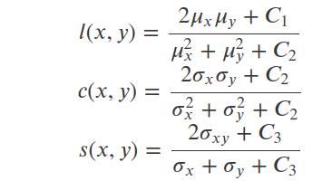

## PDF IMAGE SCRAPER 

This Repository contains a pdf image scraping tool in jupyter notebooks and  a simple algorithm for matching/retrival images using Structural Similarity Index (SSIM) on images pulled from pdf. This is indtended as a reserch tool to assist in reporcing results where code and metrics for specific images shown but the id's have not.

The dependency.txt is longer than would be for a pure code rep as this requris jupyter notebooks to be installed.

[scikit image's](https://scikit-image.org/docs/dev/api/skimage.metrics.html?highlight=ssim) built in SSIM function (metrics module) does not require an understanding of SSIM however a brief outline is below.

SSIM is outlined by Z. Wang et. al[1] is a computation of the multiplicative index of three terms- luminance, contrast, structural:

Where: 

Where 𝜇_𝑥 𝜇_𝑦  are local means 𝜎_𝑥 𝜎_𝑦 is the local standard deviation 𝜎_𝑥 𝑦 cross-covariance.
Therefore:

Fig. 1[2]

ssim of 1 is an exact match to the image

[1]Wang, Z., Bovik, A. C., Sheikh, H. R., & Simoncelli, E. P. (2004). Image quality assessment: From error visibility to structural similarity. IEEE Transactions on Image Processing, 13(4), 600–612. https://doi.org/10.1109/TIP.2003.819861

[2] Su, H., Niu, J., Liu, X., Li, Q., Wan, J., Xu, M., & Ren, T. (2020). An End-to-end Method for Producing Scanning-robust Stylized QR Codes. http://arxiv.org/abs/2011.07815

#### Instructions

> `Pip Install requirements` txt in new python 3.9.5 virtual environment

> Place PDF files that you want to pull images form in the pdfs_to_scan folder.

> Place images that you want to match against in images_sample_database.

n.b Running notebook may take some time according to how many images are in your  batch of images to identity or image to identity folder.

I have used images from recent pulblication in the The [Computer Vision Foundation](https://www.thecvf.com/) to illustrate. The images are also really amazing examples of computer vision research. 

#### Papers used:

Liu, Z., Wang, J., Gong, S., Tao, D., & Lu, H. (2019). Deep reinforcement active learning for human-in-the-loop person re-identification. Proceedings of the IEEE International Conference on Computer Vision, 2019-October, 6121–6130. [https://doi.org/10.1109/ICCV.2019.00622](https://doi.org/10.1109/ICCV.2019.00622)

Sun, P., Zhang, W., Wang, H., Li, S., & Li, X. (2021). Deep RGB-D Saliency Detection with Depth-Sensitive Attention and Automatic Multi-Modal Fusion. 1407–1417. [http://arxiv.org/abs/2103.11832](http://arxiv.org/abs/2103.11832)

Su, H., Niu, J., Liu, X., Li, Q., Wan, J., Xu, M., & Ren, T. (2020). An End-to-end Method for Producing Scanning-robust Stylized QR Codes. [http://arxiv.org/abs/2011.07815](http://arxiv.org/abs/2011.07815)

Cheng, J., Jaiswal, A., Wu, Y., Natarajan, P., & Natarajan, P. (2021). Style-Aware Normalized Loss for Improving Arbitrary Style Transfer. 134–143. [http://arxiv.org/abs/2104.10064](http://arxiv.org/abs/2104.10064)

Hosu, V., Goldlucke, B., & Saupe, Di. (2019). Effective aesthetics prediction with multi-level spatially pooled features. Proceedings of the IEEE Computer Society Conference on Computer Vision and Pattern Recognition, 2019-June, 9367–9375. [https://doi.org/10.1109/CVPR.2019.00960](https://doi.org/10.1109/CVPR.2019.00960)

Ke, Y., Tang, X., Jing, F., Datta, R., Joshi, D., Li, J., Wang, J. Z., Luo, Y., Tang, X., Cerosaletti, C. D., Loui, A. C., You, J., Perkis, A., Hannuksela, M. M., Gabbouj, M., Li, C., Gallagher, A., Loui, A. C., Chen, T., … Ullah, H. (2021). 

A Survey of Hand Crafted and Deep Learning Methods for Image Aesthetic Assessment. Lecture Notes in Computer Science (Including Subseries Lecture Notes in Artificial Intelligence and Lecture Notes in Bioinformatics), 21(7), 1–17. [https://doi.org/10.110/EUVIP47703.2019.8946180](https://doi.org/10.110/EUVIP47703.2019.8946180)

Zhang, J., Sclaroff, S., Lin, Z., Shen, X., Price, B., & Mech, R. (2016). Unconstrained salient object detection via proposal subset optimization. Proceedings of the IEEE Computer Society Conference on Computer Vision and Pattern Recognition, 2016-Decem, 5733–5742. [https://doi.org/10.1109/CVPR.2016.618](https://doi.org/10.1109/CVPR.2016.618)

